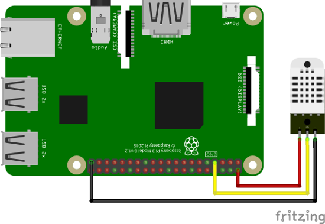

# rx-dht-sensor

A DHT11 Sensor Driven written with Noejs. Monitoring temperature and humidity changes using RxJS.

使用NodeJS驱动DHT11温度湿度传感器，并使用RxJS监测数据的变化。

# 安装

```shell
npm install rx-dht-sensor
```

# 接线

按照如下图进行接线



# 快速开始

```js
var DHTSeries = require('rx-dht-sensor');

var dht11 = new DHTSeries({
  model: 'dht11',
  address: 4
});

dht11.fetch(function (err, temperature, humidity) {
  if (err) {
    return console.error('a error occur when read dht-sensor:', err);
  }
  console.log('temperature: ' + temperature.toFixed(1) + ', humidity: ' + humidity.toFixed(1));
});
```

# 使用观察者模式监控数值

```js
// We are interested in temperature and humidity.
var observable = dht11.observe(2000);

// Now we are monitoring.
var subscription = observable.then(function subscribe(value) {
    console.log('temperature: ' + value.t.toFixed(1) + ', humidity: ' + value.h.toFixed(1));
}, function onError(err) {
    console.error('dht-sensor monitoring error.');
});

// use dispose() to stop monitor.
// subscription.dispose()
```

上面我们使用 RxJS 提供的观察者模式进行监控数据。使用 observe(interval, type='all') 同时进行温度和湿度的监控。

observe 会返回 observable（观察者） 对象，然后我们订阅温度和湿度的值。

> 注意：
> observe 只返回 观察者，此时它并不会真正的去读取传感器的数值，因为 观察者 是惰性的，现在还没有人订阅它。
> 必须使用驱动提供的 then 操作符去订阅它，或者使用 RxJS 自带的 subscribe 函数订阅。

订阅后，每隔 2s 就会打印 温度和湿度 的数值。如果想根据温度和湿度的变化进行一系列的操作，就可以在 then 回调函数里面进行。

observe 可以同时监控温度和湿度，也可以只监控 温度 或者 湿度。可以通过 type 来筛选。

### 只监控 温度：

```js
// We are only interested in temperature.
var observable = dht11.observe(2000, 't');

// Now we are monitoring.
var subscription = observable.then(function subscribe(value) {
    console.log('temperature: ' + value.toFixed(1));
}, function onError(err) {
    console.error('dht-sensor monitoring error.');
});

// use dispose() to stop monitor.
// subscription.dispose()
```

当然，驱动提供了常用的操作符用于简化业务代码。下面我们介绍驱动提供的几种操作符。

# 操作符

### max: 当数值大于设定条件的时候触发

```js
// notify when temperature larger than 28
var subscription = dht11.observe(2000, 't').max(28).then(function(value){
    console.log('好热啊！当前温度是: ', value);
});
```

### min: 当数值小于设定条件的时候触发

```js
// notify when humidity less than 20
var subscription = dht11.observe(2000, 'h').min(20).then(function(value){
    console.log('好干燥啊！当前湿度是: ', value);
});
```

### when: 当数值等于给定条件的时候触发

```js
// notify when temperature equal 20
var subscription = dht11.observe(2000, 't').when(20).then(function(value){
    console.log('当前温度是: ', value);
});
```

### between: 当数值大于左区间并且小于右区间的时候触发

```js
// notify when temperature larger than
var subscription = dht11.observe(2000, 't').between(20, 26).then(function(value){
    console.log('当前温度是: ', value);
});
```
